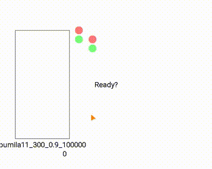

# pumila

ニューラルネットワークにぷよぷよを学習させたい

5〜8連鎖が打てます



## ビルド
* C++17が使えるコンパイラが必要です
* Eigen3がインストールされていればそれを使い、なければFetchContentで自動的にダウンロードします
    * ubuntu: `sudo apt install libeigen3-dev`
    * mac: `brew install eigen3`
* GUI(`pumila::Window`)を使うにはSDL2とSDL2_TTFをインストールする必要があります(linux, macのみ)
    * インストールされてない場合GUI関係の機能が無効化されますがビルドは可能です
    * ubuntu: `sudo apt install libsdl2-dev libsdl2-ttf-dev`
    * mac: `brew install sdl2 sdl2_ttf`
    * windowsの場合はFetchContentで自動的にダウンロードされます
* [pybind11](https://github.com/pybind/pybind11), [BS::thread_pool](https://github.com/bshoshany/thread-pool), [cli11](https://github.com/CLIUtils/CLI11) とroboto-font(GUIの表示に必要)がFetchContentでダウンロードされます
* IntelCPUの場合cmake時に`-DPUMILA_MKL_DYNAMIC=ON`または`-DPUMILA_MKL_STATIC=ON`オプションを追加するとIntel MKLを使用し計算が速くなります
    * windows: [ここ](https://www.intel.com/content/www/us/en/developer/tools/oneapi/onemkl-download.html)からoneMKLをダウンロードしインストール (古いCPUはサポートされてないっぽい)
        * インストール場所がデフォルト (`C:\Program Files (x86)\Intel\oneAPI`) でない場合は `-DPUMILA_MKL_ROOT=Path\To\oneAPI`
    * ubuntu: `sudo apt install libmkl-dev` (古めのCPUでも動く)
* MacOSの場合cmake時に`-DPUMILA_ACCELERATE=ON`オプションを追加するとAccelerateを使用し計算が速くなります
* ビルド
```sh
mkdir build
cd build
cmake ..
make
```

## 使い方

[Releases](https://github.com/na-trium-144/pumila/releases)に適当に学習後のモデルを置いているのでこれをダウンロードしてbuildディレクトリの中に置いてください

### シミュレータ
buildディレクトリの中で`./pumila-sim`を実行するとシミュレータが起動します
引数にAIのモデル(pumila3, pumila5)または player を最大2つまで指定してください

```sh
# 例 player vs AI
./pumila-sim player pumila5
```
playerの操作は A / D キーで横移動、N / M キーで回転、S キーで高速落下、(Wキーで瞬間落下) です

### 学習させる
notebook/ ディレクトリのnotebookで学習させています

jupyter, tqdm, numpy, matplotlib があれば動くと思います

AIの実装は複数ありますが、これは実装を変更するときに比較のため前のバージョンも動くよう残しているからです。
それぞれのモデルの違いは[include/pumila/models](https://github.com/na-trium-144/pumila/tree/main/include/pumila/models)内の各ファイルにコメントを書いています

学習後のモデルは`model.save_file()`によりbuildディレクトリに保存されます。
`model.load_file()`でbuildディレクトリから読み込みます。

### API
C++、PythonからシミュレータとAIを使用できます

使い方はヘッダーやnodebookを読んで
