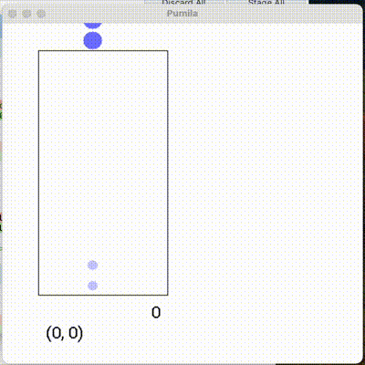

# pumila

ニューラルネットワークにぷよぷよを学習させたい

現在は1〜3連鎖が打てます



## ビルド
* C++17が使えるコンパイラが必要です
* Eigen3がインストールされていればそれを使い、なければFetchContentで自動的にダウンロードします
    * ubuntu: `sudo apt install libeigen3-dev`
    * mac: `brew install eigen3`
* GUI(`pumila::Window`)を使うにはSDL2とSDL2_TTFをインストールする必要があります
    * インストールされてない場合GUI関係の機能が無効化されますがビルドは可能です
    * ubuntu: `sudo apt install libsdl2-dev libsdl2-ttf-dev`
    * mac: `brew install sdl2 sdl2_ttf`
* [pybind11](https://github.com/pybind/pybind11), [BS::thread_pool](https://github.com/bshoshany/thread-pool)とroboto-font(GUIの表示に必要)がFetchContentでダウンロードされます
* IntelCPUの場合cmake時に`-DPUMILA_MKL=ON`オプションを追加するとIntel MKLを使用し計算が速くなります
    * ubuntu: `sudo apt install libmkl-dev`
* MacOSの場合cmake次に`-DPUMILA_ACCELERATE=ON`オプションを追加するとAccelerateを使用し計算が速くなります
* ビルド
```sh
cmake -Bbuild
cmake --build build
```

## 使い方

### シミュレータ
buildディレクトリの`pumila-play`を実行するとシミュレータが起動します
がAIを読み込んだり対戦する機能がまだないので意味なし

### 学習させる
notebook/ ディレクトリのnotebookで学習させています

jupyter, tqdm, numpy, matplotlib があれば動くと思います

AIの実装は複数ありますが、これは実装を変更するときに比較のため前のバージョンも動くよう残しているからです。
それぞれのモデルの違いは[include/pumila/models](https://github.com/na-trium-144/pumila/tree/main/include/pumila/models)内の各ファイルにコメントを書いています

学習後のモデルは`model.save_file()`によりbuildディレクトリに保存されます。
`model.load_file()`で読み込めます。[Releases](https://github.com/na-trium-144/pumila/releases)に適当に学習後のモデルを置いています

### API
C++、PythonからシミュレータとAIを使用できます

使い方はヘッダーやnodebookを読んで
